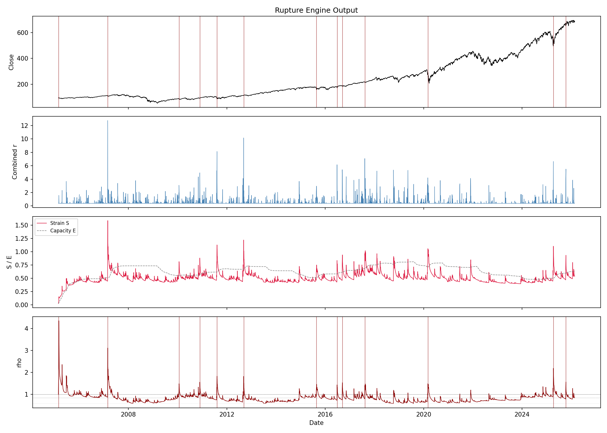

---

# Rupture Engine

A deterministic Rust CLI for detecting stress build-up and regime transitions in financial time series.

The engine ingests OHLCV bar data and produces:

* A per-bar stress time series (CSV)
* A structured rupture event log (JSON)
* A configuration snapshot for full reproducibility

This project demonstrates production-style modelling in Rust: robust statistics, adaptive thresholds, deterministic state transitions, and test coverage.

---

## Example output (SPY daily)



---

## What This Project Demonstrates

* Rolling robust statistics (median, MAD, quantiles)
* Multi-channel feature engineering
* Weighted rolling convolution (long-memory accumulation)
* Adaptive thresholding via rolling quantiles
* Deterministic finite-state machine with k-bar confirmation
* CLI argument parsing and config-driven execution
* Structured output schemas (CSV + JSON)
* Unit and integration tests in Rust

This is not a notebook experiment. It is a reproducible command-line data pipeline.

---

## System Architecture

```
            OHLCV CSV
                │
                ▼
        ┌─────────────────┐
        │ Feature Layer   │
        │ returns         │
        │ acceleration    │
        │ volume          │
        └─────────────────┘
                │
                ▼
        ┌─────────────────┐
        │ Residual Layer  │
        │ r_vol           │
        │ r_liq           │
        │ r_acc           │
        └─────────────────┘
                │
                ▼
        ┌─────────────────┐
        │ Memory Kernel   │
        │ weighted window │
        │ accumulation    │
        └─────────────────┘
                │
                ▼
        ┌─────────────────┐
        │ Adaptive        │
        │ Capacity        │
        │ rolling quantile│
        └─────────────────┘
                │
                ▼
        ┌─────────────────┐
        │ State Machine   │
        │ Stable          │
        │ Stressed        │
        │ Critical        │
        │ Candidate       │
        │ Confirmed       │
        │ Recovery        │
        └─────────────────┘
                │
                ▼
    CSV time series + JSON event log
```

---

## Pipeline Overview

### 1. Feature Extraction

From OHLCV bars:

* Log returns
* Return acceleration
* Volume

Each feature is robustly normalised using rolling median and MAD.

---

### 2. Residual Channels

Excess activity beyond configurable thresholds:

```
r_vol = max(0, u - θ_vol)
r_liq = max(0, u / (v + ε) - θ_liq)
r_acc = max(0, a - θ_acc)
```

Channels are combined using a numerically stable soft-max.

---

### 3. Strain Accumulation

Residuals are accumulated using a weighted rolling window, producing a strain signal that captures persistent stress.

---

### 4. Adaptive Capacity

Capacity is estimated as a rolling quantile of historical strain with optional smoothing.

This allows thresholds to adapt to changing volatility regimes.

---

### 5. Deterministic State Machine

The ratio

```
rho = strain / capacity
```

drives transitions through:

* Stable
* Stressed
* Critical
* Candidate
* Confirmed
* Recovery

Confirmed ruptures require m-of-k confirmation logic.

---

## Example: SPY Daily (2005–2026)

Applied to 5,000+ daily SPY bars:

* Stable: ~74%
* Stressed: ~18%
* Critical: ~2%
* Confirmed rupture episodes: 13

Major stress regimes identified:

* 2007–08 global selloff
* 2011 US downgrade / Euro crisis
* 2015 China devaluation shock
* 2016 Brexit
* 2018 volatility spike
* 2020 COVID acceleration

The system detects regime transitions without remaining permanently elevated.


---

## Quick Start

Build:

```bash
cargo build --release
```

Run:

```bash
./target/release/rupture-engine \
    --input data/spy_daily.csv \
    --config configs/default.toml \
    --output-dir output/
```

Or:

```bash
bash examples/run_spy_2008.sh
```

Plot:

```bash
python scripts/plot_results.py output/spy_2008/rupture_timeseries.csv
```

---

## Configuration

All parameters are defined in a single TOML file:

* Residual thresholds
* Memory window and exponent
* Capacity quantile
* State transition levels
* Confirmation window (k, m)

Each run writes `config_used.json` for reproducibility.

---

## Outputs

### `rupture_timeseries.csv`

Per-bar fields include:

* timestamp
* residual channels
* strain
* capacity
* rho
* state
* candidate flag
* confirmed flag

### `rupture_events.json`

Structured event records:

* candidate timestamp
* confirmation timestamp
* peak rho
* duration
* confirmation parameters

---

## Testing

```bash
cargo test
```

Includes:

* Rolling statistic tests
* Memory kernel tests
* State machine transition tests
* CLI smoke test

---

## Limitations

* Single instrument
* Deterministic and parameter-sensitive
* Designed for daily or moderate-frequency data

---

## License

MIT

---
